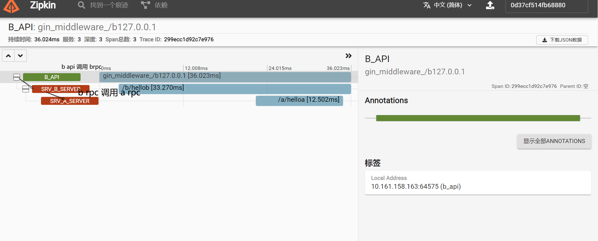
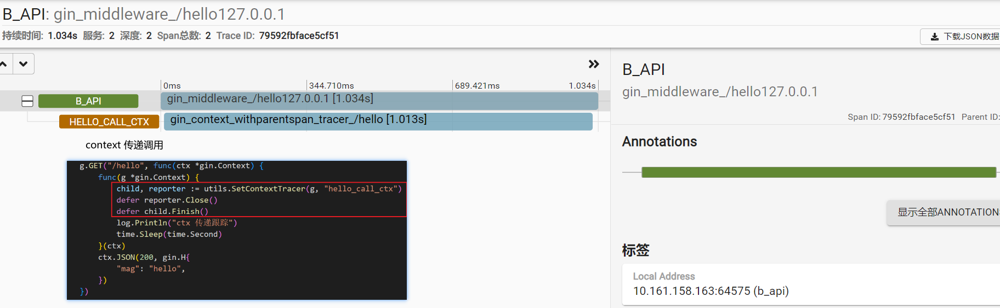

# README


# 环境准备

> 为了简单实现 demo ， 所以我们使用 docker 配置单容器的方式。 

* Go 1.18

* Gin 1.8.1

* GRpc

* protoc 3.19.4

  * protoc 生成 grpc 文件

    ```shell
    # cd 到 proto 文件
    protoc .\xx.proto --go_out=. --go-grpc_out=.
    ```

    

* 服务中心

  * consul

    ```shell
    # 启用 concul 代理
    docker run -d -p 8500:8500 -p 8300:8300 -p 8302:8302 -p 8600:8600/udp consul consul agent -dev -client=0.0.0.0
    
    # 配置更新
    docker update --restart=always <容器 id>
    ```

    

    访问 `http://ip:8500` 出现以下界面，代表成功（否则，谷歌一小下）

    

* 配置中心

  * nacos

    ```shell
    # 启动 nacos 配置中心
    docker  run --name nacos -d -p 8848:8848 --restart=always -e JVM_XMS=256m -e JVM_XMX=256m -e MODE=standalone nacos/nacos-server
    ```

    

				访问 `http://ip:8848/nacos` 出现以下界面，则成功。
	
	* 

* 负载均衡

  * rpc 负载均衡

    [grpc/load-balancing.md at master · grpc/grpc (github.com)](https://github.com/grpc/grpc/blob/master/doc/load-balancing.md)

* 网关中心


* 链路追踪

  * zipkin

    * 安装

      ```shell
      docker run -d -p 9411:9411 openzipkin/zipkin
      ```

    * 浏览器打开`http://127.0.0.1:9411`  出现以下界面，则成功

    * 
    
    * 追踪功能
    
      - [x] api 调用 rpc客户端
      - [x] rpc客户端 调用 rpc服务端
    
      
    
      - [x] ctx 传递（中间件实现）
    
      
    


  * opentracing

    * 安装

      * ```shell
        go get -u github.com/openzipkin/zipkin-go-opentracing
        go get -u github.com/grpc-ecosystem/grpc-opentracing/go/otgrpc
        ```

    * 注意

      * 为保证 gin 调用 rpc 时跟踪链路的完整性，已侵入修改 `go-otgrpc` 源码使用

* 断路器


